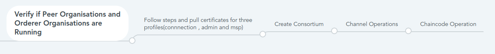

# Deploying the template 🛠

- The template can be deployed using Azure CLI or Powershell.

- Sample command to deploy from Azure CLI is as follows:
- `az deployment group create --name <deployment> --resource-group <resourceGroup> --subscription <subscriptionId> --template-uri https://<baseURI>/mainTemplate.json`

## Next Steps

-Once Peer and Orderer are deployed

# Running native HLF operations

- Sample application for performing the HLF operations. The commands are provided to Create new user identity and install your own chaincode.

## Create Connection Profiles

 - Continue the deployment by creating connection profiles.
 - [Profiles](CreatingProfiles.md)